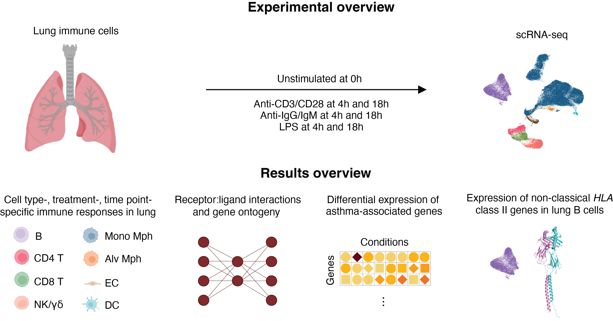

# scRNA-seq Analysis Workflow of Lung Immune Cell Responses

## Overview
This is a repository that hosts code for an ongoing project of Dynamic responses of human lung innate and adaptive immune cells. The research focues on 1) uncovering treatment-, timepoint- and cell-specific effects of innate and adaptive receptor stimulation on lung immune cells, and 2) how these dynamic responses intersect with genes the relevance genes at asthma rick loci nominated from GWAS studies. 

*Graphical abstract © Funing Tian, 2025. Licensed under [CC BY 4.0](https://creativecommons.org/licenses/by/4.0/).*

## Workflow Description
Cells were processed for scRNAseq on a Chromium X system provided by 10XGenomics. Libraries include 1) gene expression and hashtag, and 2) gene expression and antibody capture. 

Note: This repository does not include scripts for running CellRanger, which was used for initial alignment and count matrix generation. 

1. **Demultiplexiing** by antibody-derived tags: demux.R
2. **Quality control**: qc.R
3. **Integration**: integration.R
4. Quick visualizations of **cell clustering and subclustering**: integration_cell_clustering.R
5. **Cell type annotation**: celltypist.ipynb
6. Quick visualizations of **cell type annotations**: integration_celltypist_quick_visual.R
7. **Differential gene expression**
- Differentially expressed genes comparing each treated condition with unstimulated condition per cell type: integration_de.R
- Visualizations with ComplexHeatmap: integration_de_ComplexHeatmap.R
8. **Gene ontology**: integration_de_gprofiler.R
  
Only differentially expressed genes are considered. 

9. Log2-fold changes of gene expression comparing **blood and lung immune responses**: integration_blood_lung_log2.R
10. **Cell-to-cell communication**, including signaling pathways and ligand-receptor pairs: integration_cellchat.R
Visualizations include the following.
- circle plots showing the inferred intercellular communication network
- heatmaps showing the strength of incoming and outgoing signals of certain cell groups
- scatter plots showing incoming and outgoing communication probability associated with each cell group.
11. Visualizations (Dot and feature plots) for **genes of interest**, including genes associated with high-risk asthma loci identified in GWAS studies.
integration_genes_of_interest

## Manuscript preprint
A detailed description of the methods and results is available in the [preprint](https://www.biorxiv.org/content/10.1101/2024.09.20.614132v1.abstract) titled "Dynamic responses of human lung innate and adaptive immune cells highlight the roles of genes at asthma risk loci". 

## Requirements 
Please refer to [session_info_R.txt](session_info_R.txt) for the list of R packages and their versions used in the analysis.

The Jupyter Notebook is written in Python (requires Python 3.x). The main Python packages used include: numpy, pandas, matplotlib, seaborn, celltypist

## Author & Contact
Funing Tian

Email: fning.tian@gmail.com